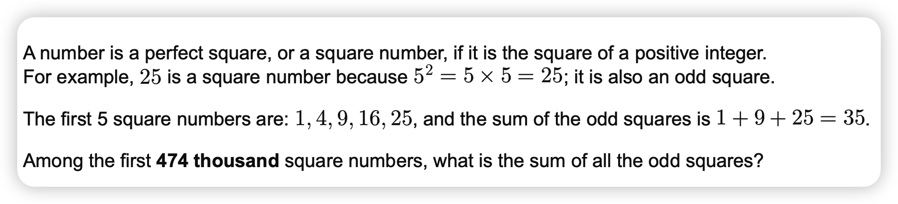
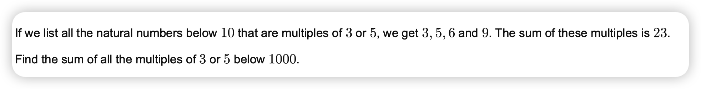
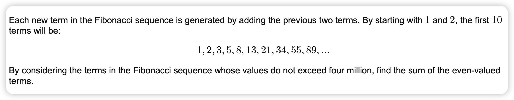
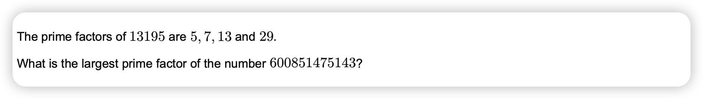
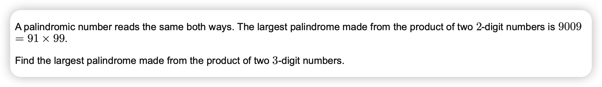
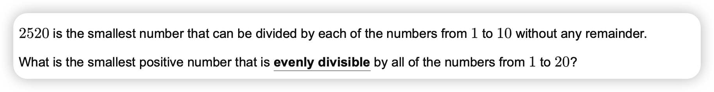

# Introduction

This is a project to learn Julia with some prombles from [Project Euler.net](https://projecteuler.net).

# Problem list

## Problem 0

## Problem 1

## Problem 2

## Problem 3

## Problem 4

## Problem 5

